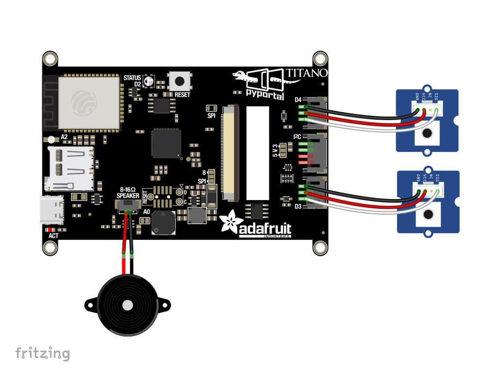

# BlueStamp PyPortal Titano Weather Station
The PyPortal Titano Retro Weather Station displays the local temperature, weather conditions, time, and date. It also contains a customizable alarm system, with multiple daily and weekly alarms. Packed in a cool 3-D printed case, the Retro Weather Station looks like a small television. 

You should comment out all portions of your portfolio that you have not completed yet, as well as any instructions:
```HTML 
<!--- This is an HTML comment in Markdown -->
<!--- Anything between these symbols will not render on the published site -->
```

| **Engineer** | **School** | **Area of Interest** | **Grade** |
|:--:|:--:|:--:|:--:|
| Pranati T | Dougherty Valley High School | Computer Engineering | Incoming Senior

**Replace the BlueStamp logo below with an image of yourself and your completed project. Follow the guide [here](https://tomcam.github.io/least-github-pages/adding-images-github-pages-site.html) if you need help.**


  
# Final Milestone


<iframe width="560" height="315" src="https://www.youtube.com/embed/F7M7imOVGug" title="YouTube video player" frameborder="0" allow="accelerometer; autoplay; clipboard-write; encrypted-media; gyroscope; picture-in-picture; web-share" allowfullscreen></iframe>

For my final milestone, I attached a 3-D printed case to my PyPortal setup. One struggle I had was that the case arrived, but no screws to fasten the case to the screen. I ended up using strings to tie the parts together, and it worked. This last milestone was the last aesthetic touch 
to my project. Moving forward, I am interested in exploring what I can connect this project to using the I2C connection. I have either the option of connecting another PyPortal or even an Arduino to the existing PyPortal. 


# Second Milestone


<iframe width="560" height="315" src="https://www.youtube.com/embed/AbE_icsdvMQ?si=x97JDMhAw7-ACikj" title="YouTube video player" frameborder="0" allow="accelerometer; autoplay; clipboard-write; encrypted-media; gyroscope; picture-in-picture; web-share" referrerpolicy="strict-origin-when-cross-origin" allowfullscreen></iframe>

For my second milestone, I customized the display and sounds of the alarm system of the project. When an alarm comes, a custom image screen drawn by me appears, and an audio of my choice plays instead of the default robot. I faced the error that although my file types for the audio files matched the original ones, the sounds were not playing. After some research, I found that the only way to make custom WAV files play on the device is to convert them from MP3 to WAV file types using Audacity. Using the following tutorial: https://learn.adafruit.com/microcontroller-compatible-audio-file-conversion I was able to resolve this issue and make my audios play without any errors.  


# First Milestone


<iframe width="560" height="315" src="https://www.youtube.com/embed/GuVc0ztC_dc?si=6TpYgbjbguBpFGdl" title="YouTube video player" frameborder="0" allow="accelerometer; autoplay; clipboard-write; encrypted-media; gyroscope; picture-in-picture; web-share" referrerpolicy="strict-origin-when-cross-origin" allowfullscreen></iframe>


My first milestone was assembling my baseline project and troubleshooting any errors I faced. I downloaded all of the files correctly, but repeatedly recieved an error in one of my code files. This code file was one of the files that came with the project bundle, so it did not make sense that there was an error in its code. After a few days of trying to fix the error, we realized that the device was not started up correctly. Following the steps to reboot the device fixed everything, and it magically began to work. In my next milestone, I want to make a second screen which can be switched to with the click of a button. This screen would display weekly alarms and their times. 

# Schematics 


# Code
Here's where you'll put your code. The syntax below places it into a block of code. Follow the guide [here]([url](https://www.markdownguide.org/extended-syntax/)) to learn how to customize it to your project needs. 
# code.py
```python
# SPDX-FileCopyrightText: 2020 Liz Clark for Adafruit Industries
#
# SPDX-License-Identifier: MIT

import time
from calendar import alarms
from calendar import timers
import board
import displayio
from digitalio import DigitalInOut, Direction, Pull
from adafruit_button import Button
from adafruit_pyportal import PyPortal
import openweather_graphics  # pylint: disable=wrong-import-position

# Get wifi details and more from a secrets.py file
try:
    from secrets import secrets
except ImportError:
    print("WiFi secrets are kept in secrets.py, please add them there!")
    raise

# Use cityname, country code where countrycode is ISO3166 format.
# E.g. "New York, US" or "London, GB"
LOCATION = secrets['location']

# Set up where we'll be fetching data from
DATA_SOURCE = "http://api.openweathermap.org/data/2.5/weather?q="+LOCATION
DATA_SOURCE += "&appid="+secrets['openweather_token']
# You'll need to get a token from openweather.org, looks like 'b6907d289e10d714a6e88b30761fae22'
DATA_LOCATION = []

# Initialize the pyportal object and let us know what data to fetch and where
# to display it
pyportal = PyPortal(url=DATA_SOURCE,
                    json_path=DATA_LOCATION,
                    status_neopixel=board.NEOPIXEL,
                    default_bg=0x000000)

display = board.DISPLAY

#  the alarm sound file locations
alarm_sound_trash = "/sounds/trash.wav"
alarm_sound_bed = "/sounds/sleep.wav"
alarm_sound_eat = "/sounds/eat.wav"

#  the alarm sounds in an array that matches the order of the gfx & alarm check-ins
alarm_sounds = [alarm_sound_trash, alarm_sound_bed,
                alarm_sound_eat, alarm_sound_eat, alarm_sound_eat]

#  setting up the bitmaps for the alarms

#  sleep alarm
sleep_bitmap = displayio.OnDiskBitmap(open("/sleepBMP.bmp", "rb"))
sleep_tilegrid = displayio.TileGrid(sleep_bitmap, pixel_shader=getattr(sleep_bitmap, 'pixel_shader', displayio.ColorConverter()))
group_bed = displayio.Group()
group_bed.append(sleep_tilegrid)

#  trash alarm
trash_bitmap = displayio.OnDiskBitmap(open("/trashBMP.bmp", "rb"))
trash_tilegrid = displayio.TileGrid(trash_bitmap, pixel_shader=getattr(trash_bitmap, 'pixel_shader', displayio.ColorConverter()))
group_trash = displayio.Group()
group_trash.append(trash_tilegrid)

#  meal alarm
eat_bitmap = displayio.OnDiskBitmap(open("/eatBMP.bmp", "rb"))
eat_tilegrid = displayio.TileGrid(eat_bitmap, pixel_shader=getattr(eat_bitmap, 'pixel_shader', displayio.ColorConverter()))
group_eat = displayio.Group()
group_eat.append(eat_tilegrid)

#  snooze touch screen buttons
#  one for each alarm bitmap
snooze_controls = [
    {'label': "snooze_trash", 'pos': (4, 222), 'size': (236, 90), 'color': None},
    {'label': "snooze_bed", 'pos': (4, 222), 'size': (236, 90), 'color': None},
    {'label': "snooze_eat", 'pos': (4, 222), 'size': (236, 90), 'color': None},
    ]

#  setting up the snooze buttons as buttons
snooze_buttons = []
for s in snooze_controls:
    snooze_button = Button(x=s['pos'][0], y=s['pos'][1],
                           width=s['size'][0], height=s['size'][1],
                           style=Button.RECT,
                           fill_color=s['color'], outline_color=None,
                           name=s['label'])
    snooze_buttons.append(snooze_button)

#  dismiss touch screen buttons
#  one for each alarm bitmap
dismiss_controls = [
    {'label': "dismiss_trash", 'pos': (245, 222), 'size': (230, 90), 'color': None},
    {'label': "dismiss_bed", 'pos': (245, 222), 'size': (230, 90), 'color': None},
    {'label': "dismiss_eat", 'pos': (245, 222), 'size': (230, 90), 'color': None},
    ]

#  setting up the dismiss buttons as buttons
dismiss_buttons = []
for d in dismiss_controls:
    dismiss_button = Button(x=d['pos'][0], y=d['pos'][1],
                            width=d['size'][0], height=d['size'][1],
                            style=Button.RECT,
                            fill_color=d['color'], outline_color=None,
                            name=d['label'])
    dismiss_buttons.append(dismiss_button)

#  adding the touch screen buttons to the different alarm gfx groups
group_trash.append(snooze_buttons[0].group)
group_trash.append(dismiss_buttons[0].group)
group_bed.append(snooze_buttons[1].group)
group_bed.append(dismiss_buttons[1].group)
group_eat.append(snooze_buttons[2].group)
group_eat.append(dismiss_buttons[2].group)

#  setting up the hardware snooze/dismiss buttons
switch_snooze = DigitalInOut(board.D3)
switch_snooze.direction = Direction.INPUT
switch_snooze.pull = Pull.UP

switch_dismiss = DigitalInOut(board.D4)
switch_dismiss.direction = Direction.INPUT
switch_dismiss.pull = Pull.UP

#  grabbing the alarm times from the calendar file
#  'None' is the placeholder for trash, which is weekly rather than daily
alarm_checks = [None, alarms['bed'],alarms['breakfast'],alarms['lunch'],alarms['dinner']]
#  all of the alarm graphics
alarm_gfx = [group_trash, group_bed, group_eat, group_eat, group_eat]

#  allows for the openweather_graphics to show
gfx = openweather_graphics.OpenWeather_Graphics(pyportal.splash, am_pm=True, celsius=False)

#  state machines
localtile_refresh = None
weather_refresh = None
dismissed = None
touched = None
start = None
alarm = None
snoozed = None
touch_button_snooze = None
touch_button_dismiss = None
phys_dismiss = None
phys_snooze = None
mode = 0
button_mode = 0

#  weekday array
weekday = ["Mon.", "Tues.", "Wed.", "Thurs.", "Fri.", "Sat.", "Sun."]

#  weekly alarm setup. checks for weekday and time
weekly_alarms = [alarms['trash']]
weekly_day = [alarms['trash'][0]]
weekly_time = [alarms['trash'][1]]

while True:
    # while esp.is_connected:
    # only query the online time once per hour (and on first run)
    if (not localtile_refresh) or (time.monotonic() - localtile_refresh) > 3600:
        try:
            print("Getting time from internet!")
            pyportal.get_local_time()
            localtile_refresh = time.monotonic()
        except RuntimeError as e:
            print("Some error occured, retrying! -", e)
            continue

    if not alarm:
    # only query the weather every 10 minutes (and on first run)
    #  only updates if an alarm is not active
        if (not weather_refresh) or (time.monotonic() - weather_refresh) > 600:
            try:
                value = pyportal.fetch()
                print("Response is", value)
                gfx.display_weather(value)
                weather_refresh = time.monotonic()
            except RuntimeError as e:
                print("Some error occured, retrying! -", e)
                continue
    #  updates time to check alarms
    #  checks every 30 seconds
    #  identical to def(update_time) in openweather_graphics.py
    if (not start) or (time.monotonic() - start) > 30:
        #  grabs all the time data
        clock = time.localtime()
        date = clock[2]
        hour = clock[3]
        minute = clock[4]
        day = clock[6]
        today = weekday[day]
        format_str = "%d:%02d"
        date_format_str = " %d, %d"
        if hour >= 12:
            hour -= 12
            format_str = format_str+" PM"
        else:
            format_str = format_str+" AM"
        if hour == 0:
            hour = 12
        #  formats date display
        today_str = today
        time_str = format_str % (hour, minute)
        #  checks for weekly alarms
        for i in weekly_alarms:
            w = weekly_alarms.index(i)
            if time_str == weekly_time[w] and today == weekly_day[w]:
                print("trash time")
                alarm = True
                if alarm and not dismissed and not snoozed:
                    display.root_group = alarm_gfx[w]
                    pyportal.play_file(alarm_sounds[w])
                mode = w
                print("mode is:", mode)
        #  checks for daily alarms
        for i in alarm_checks:
            a = alarm_checks.index(i)
            if time_str == alarm_checks[a]:
                alarm = True
                if alarm and not dismissed and not snoozed:
                    display.root_group = alarm_gfx[a]
                    pyportal.play_file(alarm_sounds[a])
                mode = a
                print(mode)
        #  calls update_time() from openweather_graphics to update
        #  clock display
        gfx.update_time()
        gfx.update_date()
        #  resets time counter
        start = time.monotonic()

    #  allows for the touchscreen buttons to work
    if mode > 1:
        button_mode = 2
    else:
        button_mode = mode
        #  print("button mode is", button_mode)

    #  hardware snooze/dismiss button setup
    if switch_dismiss.value and phys_dismiss:
        phys_dismiss = False
    if switch_snooze.value and phys_snooze:
        phys_snooze = False
    if not switch_dismiss.value and not phys_dismiss:
        phys_dismiss = True
        print("pressed dismiss button")
        dismissed = True
        alarm = False
        display.root_group = pyportal.splash
        touched = time.monotonic()
        mode = mode
    if not switch_snooze.value and not phys_snooze:
        phys_snooze = True
        print("pressed snooze button")
        display.root_group = pyportal.splash
        snoozed = True
        alarm = False
        touched = time.monotonic()
        mode = mode

    #  touchscreen button setup
    touch = pyportal.touchscreen.touch_point
    if not touch and touch_button_snooze:
        touch_button_snooze = False
    if not touch and touch_button_dismiss:
        touch_button_dismiss = False
    if touch:
        if snooze_buttons[button_mode].contains(touch) and not touch_button_snooze:
            print("Touched snooze")
            display.root_group = pyportal.splash
            touch_button_snooze = True
            snoozed = True
            alarm = False
            touched = time.monotonic()
            mode = mode
        if dismiss_buttons[button_mode].contains(touch) and not touch_button_dismiss:
            print("Touched dismiss")
            dismissed = True
            alarm = False
            display.root_group = pyportal.splash
            touch_button_dismiss = True
            touched = time.monotonic()
            mode = mode

    #  this is a little delay so that the dismissed state
    #  doesn't collide with the alarm if it's dismissed
    #  during the same time that the alarm activates
    if (not touched) or (time.monotonic() - touched) > 70:
        dismissed = False
    #  snooze portion
    #  pulls snooze_time from calendar and then when it's up
    #  splashes the snoozed alarm's graphic, plays the alarm sound and goes back into
    #  alarm state
    if (snoozed) and (time.monotonic() - touched) > timers['snooze_time']:
        print("snooze over")
        snoozed = False
        alarm = True
        mode = mode
        display.root_group = alarm_gfx[mode]
        pyportal.play_file(alarm_sounds[mode])
        print(mode)

```
# secrets.py
```python
# SPDX-FileCopyrightText: 2020 Liz Clark for Adafruit Industries
#
# SPDX-License-Identifier: MIT

# This file is where you keep secret settings, passwords, and tokens!
# If you put them in the code you risk committing that info or sharing it

secrets = {
    'ssid' : 'Wi-Fi name',
    'password' : 'Wi-Fi Password',
    'openweather_token' : 'your OpenWeather token',
    'aio_username' : "your adafruit IO username",
    'aio_key' : 'your AIO key',
    'location' : 'your location'
}
```
# calendar.py
```python
# SPDX-FileCopyrightText: 2020 Liz Clark for Adafruit Industries
#
# SPDX-License-Identifier: MIT

alarms = {
    'bed' : '10:00 PM',
    'breakfast' : '9:00 AM',
    'lunch' : '12:00 PM',
    'dinner' : '7:30 PM',
    'trash' : ('Wed.', '8:00 PM')
    }

timers = {
    'snooze_time' : 300
    }

holidays = {
    'new years' : ('Jan. 1', 'Happy New Year!'),
    'valentines' : ('Feb. 14', "Happy Valentine's Day! <3"),
    'halloween' : ('Oct. 31', 'Happy Halloween!'),
    'xmas' : ('Dec. 25', 'Merry Christmas!'),
    'birthday' : ('May. 14', 'Happy Birthday!!!')
    }

```
# openweather_graphics.py
```python
# SPDX-FileCopyrightText: 2019 Limor Fried for Adafruit Industries
# SPDX-FileCopyrightText: 2020 Liz Clark for Adafruit Industries
#
# SPDX-License-Identifier: MIT

import time
import json
from calendar import holidays
import displayio
from adafruit_display_text.label import Label
from adafruit_bitmap_font import bitmap_font

cwd = ("/"+__file__).rsplit('/', 1)[0] # the current working directory (where this file is)

small_font = cwd+"/fonts/EffectsEighty-24.bdf"
medium_font = cwd+"/fonts/EffectsEighty-32.bdf"
weather_font = cwd+"/fonts/EffectsEighty-48.bdf"
large_font = cwd+"/fonts/EffectsEightyBold-68.bdf"

month_name = ["Jan.", "Feb.", "Mar.", "Apr.", "May", "June", "July", "Aug.",
              "Sept.", "Oct.", "Nov.", "Dec."]
weekday = ["Mon.", "Tues.", "Wed.", "Thurs.", "Fri.", "Sat.", "Sun."]
holiday_checks = [holidays['new years'][0],holidays['valentines'][0],
                  holidays['halloween'][0],holidays['xmas'][0]]
holiday_greetings = [holidays['new years'][1],holidays['valentines'][1],
                     holidays['halloween'][1],holidays['xmas'][1]]

class OpenWeather_Graphics(displayio.Group):

    def __init__(self, root_group, *, am_pm=True, celsius=True):
        super().__init__()
        self.am_pm = am_pm
        self.celsius = celsius

        root_group.append(self)
        self._icon_group = displayio.Group()
        self.append(self._icon_group)
        self._text_group = displayio.Group()
        self.append(self._text_group)

        self._icon_sprite = None
        self._icon_file = None
        self.set_icon(cwd+"/weather_background.bmp")

        self.small_font = bitmap_font.load_font(small_font)
        self.medium_font = bitmap_font.load_font(medium_font)
        self.weather_font = bitmap_font.load_font(weather_font)
        self.large_font = bitmap_font.load_font(large_font)
        glyphs = b'0123456789abcdefghijklmnopqrstuvwxyzABCDEFGHIJKLMNOPQRSTUVWXYZ-,.: '
        self.small_font.load_glyphs(glyphs)
        self.medium_font.load_glyphs(glyphs)
        self.weather_font.load_glyphs(glyphs)
        self.large_font.load_glyphs(glyphs)
        self.large_font.load_glyphs(('°',))  # a non-ascii character we need for sure
        self.city_text = None
        self.holiday_text = None

        self.time_text = Label(self.medium_font)
        self.time_text.x = 365
        self.time_text.y = 15
        self.time_text.color = 0x5AF78E
        self._text_group.append(self.time_text)

        self.date_text = Label(self.medium_font)
        self.date_text.x = 10
        self.date_text.y = 15
        self.date_text.color = 0x57C6FE
        self._text_group.append(self.date_text)

        self.temp_text = Label(self.large_font)
        self.temp_text.x = 316
        self.temp_text.y = 165
        self.temp_text.color = 0xFF6AC1
        self._text_group.append(self.temp_text)

        self.main_text = Label(self.weather_font)
        self.main_text.x = 10
        self.main_text.y = 258
        self.main_text.color = 0x99ECFD
        self._text_group.append(self.main_text)

        self.description_text = Label(self.small_font)
        self.description_text.x = 10
        self.description_text.y = 296
        self.description_text.color = 0x9FA0A2
        self._text_group.append(self.description_text)

    def display_weather(self, weather):
        weather = json.loads(weather)

        # set the icon/background
        weather_icon = weather['weather'][0]['icon']
        self.set_icon("/sd/icons/"+weather_icon+".bmp")

        city_name =  weather['name'] + ", " + weather['sys']['country']
        print(city_name)
        if not self.city_text:
            self.city_text = Label(self.medium_font, text=city_name)
            self.city_text.x = 300
            self.city_text.y = 296
            self.city_text.color = 0xCF5349
            self._text_group.append(self.city_text)

        self.update_time()

        main_text = weather['weather'][0]['main']
        print(main_text)
        self.main_text.text = main_text

        temperature = weather['main']['temp'] - 273.15 # its...in kelvin
        print(temperature)
        if self.celsius:
            self.temp_text.text = "%d °C" % temperature
        else:
            self.temp_text.text = "%d °F" % ((temperature * 9 / 5) + 32)

        description = weather['weather'][0]['description']
        description = description[0].upper() + description[1:]
        print(description)
        self.description_text.text = description
        # "thunderstorm with heavy drizzle"

    def update_time(self):
        """Fetch the time.localtime(), parse it out and update the display text"""
        now = time.localtime()
        hour = now[3]
        minute = now[4]
        format_str = "%d:%02d"
        if self.am_pm:
            if hour >= 12:
                hour -= 12
                format_str = format_str+" PM"
            else:
                format_str = format_str+" AM"
            if hour == 0:
                hour = 12
        time_str = format_str % (hour, minute)
        print(time_str)
        self.time_text.text = time_str

    def update_date(self):
        date_now = time.localtime()
        year = date_now[0]
        mon = date_now[1]
        date = date_now[2]
        day = date_now[6]
        today = weekday[day]
        month = month_name[mon - 1]
        date_format_str = " %d, %d"
        shortened_date_format_str = " %d"
        date_str = today+", "+month+date_format_str % (date, year)
        holiday_date_str = month+shortened_date_format_str % (date)
        print(date_str)
        self.date_text.text = date_str
        for i in holiday_checks:
            h = holiday_checks.index(i)
            if holiday_date_str == holiday_checks[h]:
                if not self.holiday_text:
                    self.holiday_text = Label(self.medium_font)
                    self.holiday_text.x = 10
                    self.holiday_text.y = 45
                    self.holiday_text.color = 0xf2f89d
                    self._text_group.append(self.holiday_text)
                self.holiday_text.text = holiday_greetings[h]

    def set_icon(self, filename):
        """The background image to a bitmap file.

        :param filename: The filename of the chosen icon

        """
        print("Set icon to ", filename)
        if self._icon_group:
            self._icon_group.pop()

        if not filename:
            return  # we're done, no icon desired
        if self._icon_file:
            self._icon_file.close()

        # CircuitPython 6 & 7 compatible
        self._icon_file = open(filename, "rb")
        icon = displayio.OnDiskBitmap(self._icon_file)
        self._icon_sprite = displayio.TileGrid(icon,
                                               pixel_shader=getattr(icon, 'pixel_shader', displayio.ColorConverter()))

        # # CircuitPython 7+ compatible
        # icon = displayio.OnDiskBitmap(filename)
        # self._icon_sprite = displayio.TileGrid(icon, pixel_shader=icon.pixel_shader)

        self._icon_group.append(self._icon_sprite)


# Bill of Materials
Here's where you'll list the parts in your project. To add more rows, just copy and paste the example rows below.
Don't forget to place the link of where to buy each component inside the quotation marks in the corresponding row after href =. Follow the guide [here]([url](https://www.markdownguide.org/extended-syntax/)) to learn how to customize this to your project needs. 

| **Part** | **Note** | **Price** | **Link** |
|:--:|:--:|:--:|:--:|
| Adafruit PyPortal Titano | The device on which the entire project is run | $59.95 | <a href="https://www.adafruit.com/product/4444"> Link </a> |
| STEMMA Wired Tactile Push-Button Pack - 5 Color Pack | Used for the dismiss/snooze commands on the alarms | $7.50 | <a href="https://www.adafruit.com/product/4431"> Link </a> |
| JST PH 2mm 3-pin Plug-Plug Cable - 100mm long | Used to connect the STEMMA Push-Buttons to the Pyportal Titano | $0.75 | <a href="https://www.adafruit.com/product/4336"> Link </a> |
| Mini Oval Speaker - 8 Ohm 1 Watt | Plays sounds that come from the device, connected directly to the PyPortal Titano | $1.95 | <a href="https://www.adafruit.com/product/3923"> Link </a> |
| Black Nylon Machine Screw and Stand-off Set – M2.5 Thread | Used to secure the 3-D printed case onto the PyPortal screen | $16.95 | <a href="https://www.adafruit.com/product/3299"> Link </a> |
| 5V 1A (1000mA) USB port power supply - UL Listed | Used to connect the PyPortal to a wall electrical outlet  | $5.95 | <a href="https://www.adafruit.com/product/501"> Link </a> |
| USB Type A to Type C Cable - approx 1 meter / 3 ft long | Used to connect PyPortal Titano to either a computer or other power source. When connected to a computer, the USB cable is used to save code from the computer and update the project screen. When used to plug into a wall electrical outlet, the cable works to supply power to the device. | $4.95 | <a href="https://www.adafruit.com/product/4474"> Link </a> |
| 8GB micro SD Card | Used to store high-storage files which the PyPortal Titano does not have the storage to store in itself | $9.95 | <a href="https://www.adafruit.com/product/2692"> Link </a> |

# Other Resources/Examples
One of the best parts about Github is that you can view how other people set up their own work. Here are some past BSE portfolios that are awesome examples. You can view how they set up their portfolio, and you can view their index.md files to understand how they implemented different portfolio components.
- [Example 1](https://trashytuber.github.io/YimingJiaBlueStamp/)
- [Example 2](https://sviatil0.github.io/Sviatoslav_BSE/)
- [Example 3](https://arneshkumar.github.io/arneshbluestamp/)

To watch the BSE tutorial on how to create a portfolio, click here.
